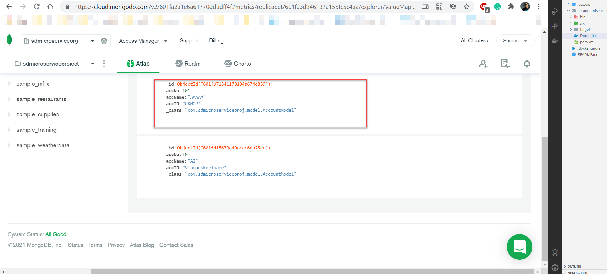

# Developing and Deploying your first Spring Boot Microservice Application to Kubernetes
### As part of this document, we'll:

1. Create a Spring Boot Application
1. Connect to MongoDB Cloud
1. Containerization via Docker
1. Setting up of Kubernetes Cluster
1. Deployment 
1. Perform CRUD operation 
1. Scaling and replicas....( In Process )


# Introduction
In this tutorial, we will be developing a sample microservice application with Spring Boot framework. Afterwards, we will deploy the containersed application onto a local Kubernetes environment, also known as Minikubecluster.

For our example application, we’ll create a valuemapping pair service microservice which will be exposed externally to REST endpoints for CRUD(create) operations . The sample microservice is a codepair creation service which will take accNo, accName and accID as input and creates a new value-mapping pair and stores in a cloud hosted MongoDB database.

### Process Flow


### What you are going to need:
In this activity we will use following tools/frameworks. Make sure it is already installed in your system —

* IDE - An IDE which supports Java spring-boot environment i.e VSCode, Eclipse , Atom etc. 

* Git,Maven— These are the technologies from our standard Spring Boot stack. We need them for our build and deployment perspectives.

* Docker — This is the most popular container technology and we will use it to work with Kubernetes. You can visit https://www.docker.com/get-started to get the appropriate docker setup on your machine. 

* Minikube — This is tool which can run a single-node Kubernetes cluster. This is useful for learning purpose. You can get the complete installation instructions at https://kubernetes.io/docs/tasks/tools/install-minikube/. Product ready Kubernetes installation comes separately.

* Kubectl — This is the command line tool to run kubernetes commands. You can use it to deploy applications, inspect and manage cluster resources, and view logs. Complete instructions available at https://kubernetes.io/docs/tasks/tools/install-kubectl/

* MongoDB-Cloud based MongoDB Database is used in this example https://cloud.mongodb.com/ (Signup). However, local server can be used as well


## Configuring MongoDB Cloud through Spring

Create a simple MongoDB cluster and database hierarchy as below. Make sure to provide user right access as well.

 

Once username/password is created for database, update same in application.properties file as well as shown below.

```
spring.data.mongodb.uri=mongodb+srv://<username>:<password>@cluster0.<url>.mongodb.net/<tablename>?retryWrites=true&w=majority
spring.data.mongodb.database=ValueMapping
server.port=8012
logging.level.org.springframework.web=DEBUG
```

The above configurations are needed for spring boot microservice application to interact with Hosted MongoDB. 

## Building Application

. Remember we need not create database and collection manually in the database. Simply by calling this microservice, everything will be created automatically and stores data in flexible, JSON-like documents.


### The Code 
```sh
$ git clone https://github.com/sharadiiita/sd-microservice-play.git

```
Building the project

```sh
$ maven clean install

```
Running the project

```sh
$ java -jar target/*.jar

```
You can access your app on http://localhost:8012/valuemapping/add.

**But it's not yet complete.**

##  Dockerizing Your Microservice
Make sure docker service is up and running via below command. It should not return error
```sh
$ docker ps

```
And now we can create our Dockerfile:
````
FROM openjdk:11
EXPOSE 8012
ARG JAR_FILE=target/*.jar
COPY ${JAR_FILE} myapp.jar
ENTRYPOINT ["java","-jar","/myapp.jar"]
````

### Create your image:

```sh
$ docker build -t myapp .

```

Sample output look like below 
 

### Running the container
Once docker image is succesfully build. We can test and run it by using below command.

```sh
$ docker run -p 8012:8012 myapp

```

 

Go to Postman and send request as below
```
http://localhost:8012/valuemapping/add
```

### Sample Request

```
{
  "accNo" : 101,
  "accName" : "AAAAA",  
  "accID" : "CRMOP"
}
```
 

### Sample Response
 
```
```

## Document stored in MongoDB



Here we can see the codevalue data are stored as JSON-like document. ObjectId is the unique key automatically created by MongoDB when a new document is inserted.

# Kubernetes — the container orchestrator
It all starts by creating a Kubernetes cluster.

## Creating a local Kubernetes cluster

Create a Kubernetes cluster on your local machine with a tool like Minikube. Makesure MiniKube is installed and working as per Hyper-V setting

```sh
$ start minikube

```

 


As minikube uses it own Docker demon which is running inside it so we need to switch it 

```sh
$ sminikube docker-env
$ minikube docker-env | Invoke-Expression

```

Afterwards, you need to rebuild you image .


## Running the app from a container

To start the container, services and  expose it to external traffic(By default, the Pod is only accessible by its internal IP address within the Kubernetes cluster): 

run the following commands:

```sh
$ kubectl run myapp --image=myapp --port=8012
$ kubectl create deployment myapp --image=myapp 
$ kubectl expose deployment myapp --type="LoadBalancer" --port 8012      
$ minikube service myapp --url
```

If everthing is green like pods, replica sets etc.

 

then we are ready to access our application on kubernetes at the IP address of the Minikube .


### Todos

 - Scaling
 - Replicas
 .....


**Author: Sharad Dixit** 